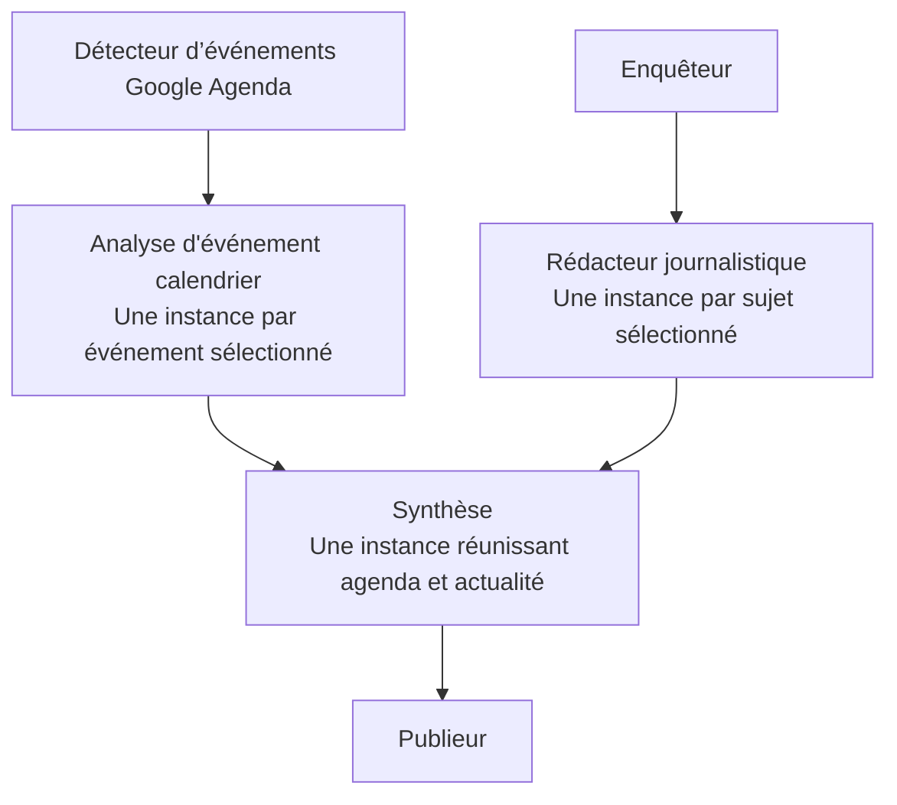

# Analyse de « Google Agenda (2) » — 6 septembre 2026

## Périmètre et méthode

Cette analyse porte sur la façon dont Cortex charge, conserve, orchestre et représente le projet « Google Agenda (2) ». Les instructions métier du projet ne sont pas modifiées.

Les éléments examinés sont les fichiers locaux `projects/Google Agenda (2)/AGENTS.md` et les six définitions `.codex/agents/*.toml`, la configuration locale de Cortex, son historique SQLite ouvert en lecture seule, le code de chargement et d'exécution, ainsi que l'interface du [projet sur le serveur](https://cortex.patinaud.org/?project=e338b35b-0a2a-47c7-9fef-d101bcc1edd2).

Le projet de production était en cours d'exécution au moment de l'inspection. Aucune exécution métier n'a été lancée, arrêtée ou relancée pour cette analyse. Aucun agent n'a été chargé d'accéder à l'agenda, de rechercher des actualités, de publier un fichier ou d'envoyer un message. Aucun déploiement n'a été effectué.

## Fonctionnement métier établi par les fichiers

Le projet comporte deux recherches initiales indépendantes. Elles alimentent deux traitements spécialisés, puis un même livrable HTML et une étape de publication.



| Agent | Responsabilité définie dans le TOML | Dépendance attendue |
| --- | --- | --- |
| Détecteur d’événements Google Agenda | Rechercher les événements futurs pertinents des agendas personnels autorisés, exclure les agendas publics et dédupliquer. | Racine indépendante. |
| Analyse d'événement calendrier | Recevoir un événement du Détecteur par instance, le compléter et proposer des actions de préparation. | Détecteur. |
| Enquêteur | Rechercher les actualités récentes pertinentes pour Kévin et produire des sujets sélectionnables. | Racine indépendante. |
| Rédacteur journalistique | Approfondir un seul sujet transmis par l'Enquêteur et rédiger un article sourcé. | Enquêteur. |
| Synthèse | Réunir les événements issus de l'agenda et de l'actualité dans un seul fichier HTML. | Toutes les instances applicables d'Analyse et de Rédacteur ; mode `aggregate`. |
| Publieur | Créer un fichier HTML contenant le lien d'accès au livrable. | Synthèse. |

Les deux racines ne se transmettent aucune donnée. Le résultat de l'Enquêteur est destiné au Rédacteur, celui du Détecteur à l'Analyse. La Synthèse doit attendre l'achèvement des deux branches applicables. Une branche écartée explicitement par les résultats ne doit pas empêcher la synthèse de l'autre branche.

Le paramètre `{AGENDA_HTML}` désigne une sortie produite par la Synthèse et utilisée ensuite par le Publieur. Il ne s'agit pas d'une donnée que l'utilisateur doit connaître avant de commencer.

Le fichier global `AGENTS.md` décrit principalement l'agenda. Les instructions des agents Enquêteur, Rédacteur et Synthèse étendent explicitement le projet à l'actualité. L'analyse du graphe doit donc tenir compte des six prompts, et ne peut pas se limiter au nom du projet ou au seul fichier global.

## Différence de chargement observée

L'identifiant local est `1442b75c-5d1b-41d9-9473-25ff62b134d7`. L'identifiant du projet serveur est `e338b35b-0a2a-47c7-9fef-d101bcc1edd2`. Cette différence est normale pour deux inscriptions du projet dans deux installations ; elle révèle toutefois que le cache de graphe indexé uniquement par identifiant Cortex ne voyage pas avec les définitions d'agents.

Au début de l'analyse, `config.json` référençait bien le dossier local mais ne contenait aucune entrée `agentWorkflows` pour cet identifiant. Le dossier du projet contenait les six TOML, `AGENTS.md` et deux livrables HTML, sans définition portable du graphe. L'historique SQLite local ne contenait aucune exécution pour l'identifiant local ni pour celui du serveur.

L'interface serveur montrait les deux racines et les deux branches convergentes décrites ci-dessus. Le chargement local présentait au contraire la chaîne suivante :

```text
Analyse → Détecteur → Enquêteur → Publieur → Rédacteur → Synthèse
```

La comparaison des textes complets des six instructions rendus dans les deux interfaces a ensuite donné six correspondances sur six, après normalisation des espaces. La différence de graphe ne correspond donc pas à une différence de responsabilités visible dans les prompts des agents. Cette comparaison porte sur le texte rendu, sans prétendre comparer les octets des fichiers distants.

Cette chaîne correspond à l'ordre des noms de fichiers TOML, pas à leurs responsabilités. Elle lance l'Analyse avant son fournisseur d'événements et le Publieur avant la production du fichier à publier.

Dans l'implémentation initiale de `AgentUseCase.loadProject`, Cortex appliquait d'abord une chaîne avec `applyLinearWorkflow`. `configureAgentWorkflow` cherchait ensuite une configuration en cache, indexée par identifiant de projet et empreinte du contenu ; sans cache valide, il sollicitait le moteur IA pour inférer le graphe. En cas d'échec, son bloc `catch` conservait la chaîne basée sur l'ordre des fichiers et retournait simplement une liste vide de paramètres.

Ce mécanisme explique comment des fichiers métier identiques peuvent être présentés avec des dépendances différentes selon la machine, son cache et la disponibilité de son moteur. Le chemin de repli est prouvé par le code et le résultat local ; l'inspection seule ne permet pas d'attribuer l'échec précis du moteur à une cause unique.

## Démarrage et parallélisme

Le dossier métier ne contient aucun script de démarrage shell, PowerShell ou JavaScript. Les « deux démarrages » du workflow correspondent à deux agents racines, chacun avec ses instructions. Ils doivent être représentés comme deux points d'entrée indépendants du même workflow.

Dans l'orchestrateur initial, `runWorkflow` recherchait un seul agent prêt avec `project.agents.find(...)`, puis attendait la fin de son `runAgent` avant d'en choisir un autre. Un graphe pouvait donc afficher deux branches parallèles tout en les exécutant successivement lors d'une exécution complète. Le parallélisme entre plusieurs instances d'un même agent était un mécanisme distinct.

La résolution des entrées possède déjà une règle d'agrégation : `resolveUpstreamItemGroups` attend les prédécesseurs applicables et, avec `inputMode: "aggregate"`, réunit leurs éléments dans une seule instance. Cette garantie doit être préservée lorsque les deux racines et leurs branches deviennent exécutables en parallèle.

## Chemins de publication et différences d'environnement

Les instructions métier contiennent volontairement des emplacements Linux précis :

| Étape | Emplacement ou URL dans le prompt |
| --- | --- |
| Synthèse | `/var/www/KevinPatinaud/journal/` |
| Publieur | `/home/kevin/apps/send_mail/projects/journal/` |
| Lien produit | `https://kevinpatinaud.fr/journal/{AGENDA_HTML}` |

Ces chemins décrivent l'environnement cible de publication et ne correspondent pas au dossier Windows local de Cortex. Ils peuvent expliquer des différences d'effets lors d'une véritable exécution sur Windows et sur Linux. Ils n'expliquent pas à eux seuls les dépendances graphiques erronées et ne doivent pas être réécrits pour corriger Cortex.

Le prompt du Publieur demande de créer un fichier dans un dossier associé à l'envoi de mail ; il ne contient pas lui-même de commande d'envoi. L'inspection n'a pas vérifié le fonctionnement du service externe qui surveille éventuellement ce dossier.

## Régressions à couvrir

- Un graphe conservé avec le projet survit à son transfert entre deux installations ayant des identifiants et des chemins différents.
- Les deux racines restent des racines, les deux branches restent distinctes et la Synthèse conserve son mode d'agrégation.
- Un cache absent ou invalide ne transforme pas silencieusement le workflow en chaîne exécutable.
- Des chargements concurrents du même projet ne déclenchent pas plusieurs inférences concurrentes ni des graphes différents.
- Les deux racines peuvent démarrer une seule fois chacune avec le contexte commun, puis leurs traitements poursuivent leur branche respective.
- La Synthèse attend tous les traitements applicables, y compris les instances multiples d'une même branche, puis le Publieur s'exécute après elle.
- Une branche non sélectionnée est sautée ; une branche encore en cours ou en échec n'est pas confondue avec une branche sautée.
- Une reprise partielle conserve les résultats réussis et ne rejoue pas une racine ou une publication déjà terminée.
- Le graphe affiche deux entrées, deux chemins lisibles et leur convergence, y compris sur une largeur réduite.

## Correctifs et validation

### Gestion du graphe et exécution

- Le chargement ne construit plus de chaîne de remplacement. Si l'analyse échoue sans graphe valide, il retourne une erreur explicite.
- Les chargements simultanés du même projet partagent une seule analyse. L'analyse utilise le mode lecture seule du fournisseur et ne réutilise pas les autorisations d'exécution automatique.
- L'empreinte des instructions est stable face aux différences CRLF/LF et à l'ordre de lecture des fichiers. Les empreintes anciennes restent acceptées pour éviter une réanalyse inutile.
- L'export `.ctx` ajoute une entrée virtuelle `.cortex/workflow.json` lorsqu'un graphe valide correspond aux fichiers actuels. Aucun fichier n'est ajouté au projet exporté. L'import restaure ce graphe sous le nouvel identifiant Cortex, puis retire cette métadonnée des fichiers publiés.
- Lors d'une conversion Codex/Claude/Copilot, l'import remappe les identifiants des agents en conservant les arêtes et le mode d'agrégation. Les sessions, les valeurs des paramètres et les planifications ne sont pas transférées.
- L'orchestrateur démarre les agents prêts en parallèle et réévalue les dépendances après chaque fin d'agent. Une branche peut donc avancer pendant que l'autre est encore en cours ; la Synthèse attend tous ses prédécesseurs applicables. Le nombre de sessions simultanées reste borné par le budget commun du workflow.
- L'annulation, le plafond d'exécutions, les résultats déjà terminés et la reprise après échec sont conservés. Une erreur attend l'enregistrement des branches déjà lancées avant de libérer le workflow.

### Représentation et commandes

- Les niveaux sont calculés d'après les dépendances, indépendamment de l'ordre reçu de l'API.
- Les branches gardent leur colonne et la convergence est représentée explicitement. Les connecteurs relient les cartes réellement dépendantes, avec des liens vers leurs successeurs ; les retours restent réservés aux véritables cycles.
- « Lancer les 2 points d'entrée » démarre les deux racines avec leurs précisions propres et les paramètres communs. Chaque agent conserve son mode manuel ou automatique.
- Les titres, modes et modèles s'adaptent à la largeur de la carte. Sur petit écran, les cartes s'empilent et les connexions contournent les cartes intermédiaires.

### Projet local et vérifications

Le graphe métier établi ci-dessus a été restauré dans l'entrée locale `agentWorkflows` de Cortex. Les neuf fichiers de `projects/Google Agenda (2)` ont gardé leurs empreintes SHA-256. La vérification n'a appelé aucun moteur et n'a déclenché aucune exécution métier. L'ancienne configuration du graphe (absente), les arêtes rétablies et les empreintes sont consignées dans `artifacts/google-agenda-restoration.json`.

Un export/import du **projet réel** a été réalisé dans un répertoire temporaire, avec zéro fournisseur IA disponible : le chargement a réussi, les six agents, les deux racines, les agrégations et les neuf fichiers ont été conservés. Résultat dans `artifacts/google-agenda-portability-verification.json` ; répertoire temporaire supprimé après contrôle.

- `npm run check` : typecheck, **271 tests réussis**, un test ignoré et build de production réussis.
- Tests navigateur ciblés : **28 réussites**, puis **8 réussites** après l'ajustement final des titres/modèles, aux largeurs 390, 700, 980 et 1440 pixels.
- Contrôle manuel par navigateur du vrai projet local, notamment à 390 et 980 pixels : deux racines visibles, dépendances correctes et en-têtes lisibles.
- `npm run test:e2e` : **175 tests réussis**, cinq cas ignorés selon leur largeur cible, aucun échec (390, 700, 980 et 1440 pixels).

Les journaux sont conservés dans `artifacts/google-agenda-check.log` et `artifacts/google-agenda-e2e.log`. Captures de la topologie simulée utilisée pour les régressions : [390 pixels](../artifacts/google-agenda-2026-09-06/workflow-390.png), [980 pixels](../artifacts/google-agenda-2026-09-06/workflow-980.png), [1440 pixels](../artifacts/google-agenda-2026-09-06/workflow-1440.png).

Les correctifs sont présents dans le dépôt et le frontend compilé. Le serveur local déjà lancé garde son code backend en mémoire jusqu'à son prochain redémarrage ; son graphe local a néanmoins été rechargé et son nouvel affichage vérifié. Le serveur distant n'a pas été redéployé et son exécution en cours n'a pas été interrompue. Les chemins de publication Linux sont inchangés.

## Complément : informations graphiques d'exécution

La première correction conservait la topologie, mais les connecteurs génériques avaient supprimé les repères de bifurcation et de multithread. Le complément rétablit ces informations sans modifier les instructions du projet ni les règles d'exécution.

| Information | Affichage et source de vérité |
| --- | --- |
| Entrées indépendantes | Nombre de racines et possibilité de démarrage en parallèle. |
| Instances d'un agent | Badge permanent : nombre prévu lorsque les résultats et sélections permettent de le calculer ; nombre de sessions conservées après exécution ou pendant une relance individuelle. Un nombre supérieur à un porte le repère « Multithread ». |
| Choix non encore connu | Bifurcation « Branches conditionnelles · choix selon résultat » et destinations possibles en pointillés. Le graphe statique ne garantit pas un choix exclusif. |
| Une destination retenue | « 1 branche retenue sur N », flèche verte vers la branche retenue, lien atténué vers la branche écartée. |
| Plusieurs destinations retenues ensemble | Badge explicite et flèches vertes. Leur démarrage reste soumis aux prérequis et au mode manuel ou automatique ; cette sélection ne garantit pas une exécution simultanée. |
| Choix différent selon l'instance | « Routage selon l'instance ». Les destinations choisies par plusieurs réponses ne sont pas présentées comme un envoi de chaque résultat vers toutes les destinations. |
| Exécution en cours | Flèche bleue animée vers la destination en cours ; l'animation respecte la préférence de mouvement réduit. |
| Convergence | « Attend les branches retenues » ; l'agrégation est identifiée comme une seule instance recevant les résultats entrants. |

Les états reposent sur les réponses structurées, les sélections et les sessions existantes. Une réponse absente, ancienne sans routage, invalidée, interrompue ou partielle n'est pas utilisée pour annoncer abusivement qu'une branche est écartée. Le compteur de sessions ne prétend pas compter les instances exécutées simultanément : elles peuvent être réparties en lots.

Le contrôle visuel du projet local a confirmé les deux entrées, les huit instances conservées du Rédacteur journalistique et leur convergence vers l'agrégation de Synthèse. Des scénarios simulés couvrent aussi les bifurcations absentes de ce projet, les changements de sélection et le rechargement de page, sans appeler de moteur réel.

Validation finale du complément : `npm run check` réussit (295 tests réussis, un cas ignoré, typecheck et build). Les 52 tests navigateur ciblant la sémantique, les branches parallèles et la continuation réussissent aux largeurs 390, 700, 980 et 1440 pixels. Journaux : `artifacts/workflow-semantics-check.log` et `artifacts/workflow-semantics-e2e.log`. Captures contrôlées : [choix conditionnel sur mobile](../artifacts/workflow-semantics-results/workflow-semantics-conditi-c22d4-d-branch-and-survive-reload-chromium-390/workflow-conditional.png), [branches retenues ensemble](../artifacts/workflow-semantics-results/workflow-semantics-conditi-9b3c0-branches-and-survive-reload-chromium-1440/workflow-parallel.png), [multithread et agrégation](../artifacts/workflow-semantics-results/workflow-semantics-selecte-aecdb--aggregation-survive-reload-chromium-700/workflow-instance-counts.png).

Le frontend corrigé est compilé et vérifié sur le projet local. Ce complément n'a pas été déployé sur le serveur distant.
