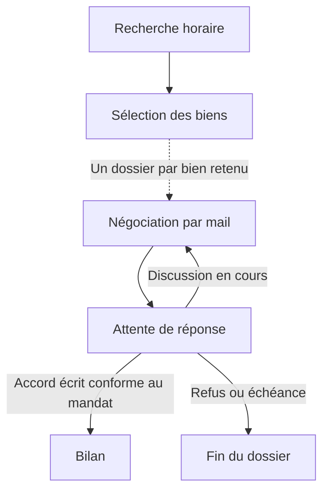

# Veille et dossiers asynchrones dans un projet

Le même projet contient la recherche, la sélection et le suivi indépendant de chaque résultat. Cortex identifie les branches asynchrones en analysant les instructions lors du chargement du graphe. Il n’y a ni onglet Automatisations, ni projet cible à choisir, ni règle à activer séparément.

## Utilisation

1. Décrire les rôles et transmissions dans les instructions du projet et de ses agents : par exemple, rechercher des annonces, sélectionner les meilleures, puis négocier chaque bien dans un dossier indépendant. Préciser les conditions d’accord, de refus et d’expiration.
2. Charger le projet. Le graphe montre une liaison violette vers la branche indépendante et le badge **Asynchrone** sur les agents concernés. Le chargement analyse la structure ; il n’exécute pas les agents et ne transmet pas d’anciens résultats.
3. Renseigner les paramètres et lancer le workflow, ou utiliser **Planifier** pour une veille horaire. Chaque nouveau résultat retenu crée automatiquement un dossier. La négociation en attente ne bloque pas la prochaine recherche.
4. Consulter les dossiers directement sous l’agent d’entrée de la branche. Ouvrir un dossier permet de lire les échanges, transmettre une réponse, l’arrêter ou reprendre un échec après vérification. Un agent qui demande une information apparaît **À préciser**, avec la raison visible sur sa carte.

Pour des résultats déjà présents avant la mise en place de la branche, **Continuer avec les résultats disponibles** transmet la sélection existante sans refaire la recherche. Cette action reste soumise à la déduplication.

Pour un dossier **À préciser**, renseigner **Précisions pour reprendre ce dossier**, puis **Transmettre et reprendre**. Indiquer les informations manquantes ou la correction effectuée ; une reprise vide est refusée pour éviter de répéter le même blocage. Ces précisions sont enregistrées avec leur date, transmises à la session existante et conservées pour les étapes et réveils suivants du dossier. Elles ne modifient pas les paramètres de la veille ni ceux des autres dossiers. La reprise peut déclencher les actions autorisées, notamment des envois de mails. Les véritables pannes restent affichées **Échec**.

**Modifier le projet** édite tous les fichiers et instructions ensemble. Une modification du projet entraîne une nouvelle analyse de son graphe. Les dossiers déjà créés gardent leur propre copie du graphe, des instructions et des paramètres. L’onglet **Historique** conserve leur accès, y compris si leur ancienne branche a été retirée du projet.

## Exemple immobilier

La planification lance uniquement la veille. Les agents appartenant aux dossiers ne sont pas exécutés comme des racines supplémentaires du projet. Tous les agents référencés par une branche doivent appartenir au même projet ; une branche indépendante ne peut pas revenir dans la veille.

Une attente durable ne suffit pas, à elle seule, à créer une branche indépendante : Cortex distingue un agent qui attend dans le traitement courant d’une veille qui ouvre un suivi séparé par résultat.

## Résultats et persistance

Cortex fournit automatiquement au déclencheur le format de sortie requis. Chaque résultat retenu contient une clé stable, un titre et les informations utiles au suivi. Une même clé ne crée pas deux dossiers dans la même branche, même après une nouvelle recherche ou un redémarrage. Une sélection vide n’ouvre aucun dossier.

Les dossiers héritent des paramètres du projet au moment de leur création. Leurs sessions, conversations, événements et attentes sont isolés. Les fichiers restent dans le répertoire partagé du projet ; les fichiers produits pour un dossier doivent donc porter un nom propre à ce dossier.

Une réponse `blocked` ou `error` arrête la branche et conserve l’explication, la session et l’éventuel événement de réveil pour une reprise explicite. Un accord, un refus et une échéance n’affectent que le dossier concerné. Les réponses répétées avec le même identifiant ne sont pas appliquées deux fois.

Le serveur doit rester allumé pour les recherches planifiées et les réveils. Après redémarrage, les attentes persistées reprennent lorsqu’un événement ou une échéance le permet. Une action interrompue exige une reprise explicite. Une modification de structure ou la migration d’une ancienne règle en pause ne lance pas de résultats antérieurs par simple chargement.

Les anciennes liaisons internes sont intégrées au graphe en conservant leurs identifiants et leur historique de déduplication. L’export `.ctx` conserve les branches internes et les adapte en cas de conversion de moteur à l’import. Une archive n’emporte ni dossiers, ni conversations, ni valeurs de paramètres, et son import ne lance aucune exécution.

## API de suivi

La configuration provient des instructions et du graphe analysé. L’ancienne API de création manuelle des règles et de choix d’un autre projet n’est plus exposée. Les routes de suivi sont conservées pour les dossiers existants :

| Méthode | Route | Usage |
| --- | --- | --- |
| GET | `/api/automations/:projectId/rules` | Liaisons détectées, en lecture |
| GET | `/api/automations/:projectId/jobs?offset=0&ruleId=…` | Dossiers du projet, éventuellement filtrés par branche |
| POST | `/api/automations/:projectId/continue` | Transmettre les résultats sauvegardés de `{ "agentId": "…" }` |
| GET | `/api/automations/:projectId/jobs/:id` | État et conversations du dossier |
| POST | `/api/automations/:projectId/jobs/:id/events` | Transmettre `{ "id": "message-unique", "key": "cle-attendue", "payload": "réponse" }` |
| POST | `/api/automations/:projectId/jobs/:id/cancel` | Arrêter ce dossier |
| POST | `/api/automations/:projectId/jobs/:id/resume` | Reprendre avec `{ "clarification": "informations ou correction" }` ; texte obligatoire pour un blocage, facultatif pour une panne/interruption |

Un suivi Gmail associé à l’identifiant du dossier ne réveille que celui-ci. La connexion au compte et les permissions d’envoi restent à vérifier par l’agent avant tout contact réel.
